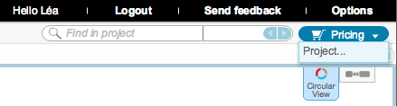
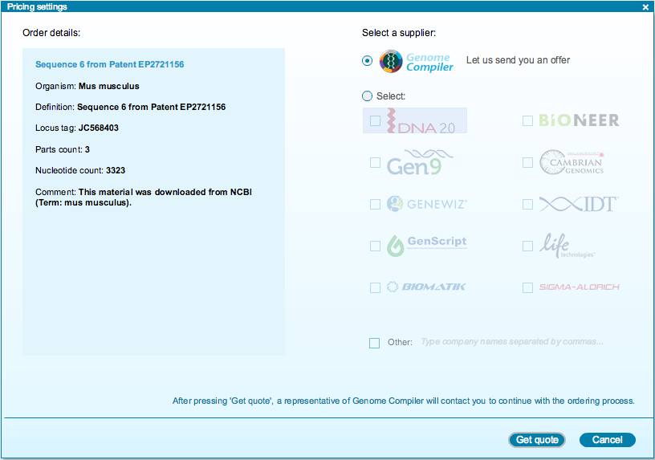

-   To request a price quote for synthesising a whole project, go to the
    ”Pricing” icon in the toolbar and click ”Project...”
    (Figure [1.12.1.1](#x1-60001r1)).

    ------------------------------------------------------------------------

    

    
    
    

    Figure 1.12.1.1: ”Project” in the ”Pricing” drop down menu in the
    toolbar.

    

    

    ------------------------------------------------------------------------

-   The ”Pricing settings” dialog will appear
    (Figure [1.12.1.2](#x1-60002r2)). Select a supplier from the list
    and click ”Get quote”. A representative from Genome Compiler will
    contact you to continue with the ordering process.

    ------------------------------------------------------------------------

    

    
    
    

    Figure 1.12.1.2: The
    ”Pricing settings” dialog for projects.

    

    

    ------------------------------------------------------------------------
