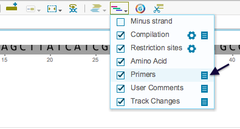
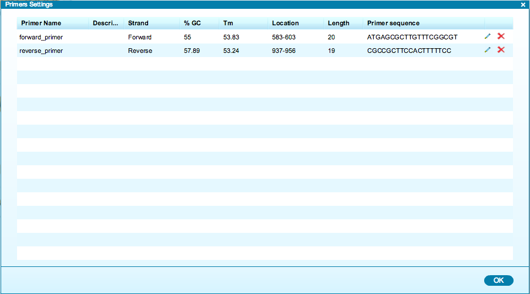

-   To view a summary table of all primers, click the primers “Summary
    table” icon in the toolbar drop down Layers menu
    (Figure [1.18.3.1](#x1-85001r1)). You can remove the primers from
    the views by unchecking the box.

    ------------------------------------------------------------------------

    

    
    
    

    Figure 1.18.3.1: The
    primers ”Summary table” icon in the toolbar drop down Layers
    menu.

    

    

    ------------------------------------------------------------------------

-   The primers summary table (Figure [1.18.3.2](#x1-85002r2)) displays
    all the primers from the project, as well as their name,
    description, strand, GC content, melting temperature (calculated
    according to [SantaLucia
    1998](http://www.pnas.org/content/95/4/1460.full)), location,
    length and sequence. You can navigate to each primer in the DNA
    sequence by clicking on it. Click the ”Edit” icon to edit a primer,
    or the ”Delete” icon to delete it.

    ------------------------------------------------------------------------

    

    
    
    

    Figure 1.18.3.2: The
    primers summary table.

    

    

    ------------------------------------------------------------------------
