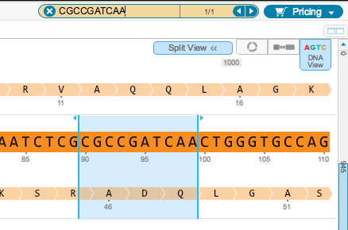

-   Type a keyword or a DNA sequence in the search bar
    (Figure [1.7.1.1](#x1-38001r1)) in the top right of the screen and
    click enter. The arrows allow you to navigate through the results.

    ------------------------------------------------------------------------

    

    
    
    

    Figure 1.7.1.1: The
    search bar in the top right of the screen.

    

    

    ------------------------------------------------------------------------

-   The search tool will look for your keyword in everything contained
    in the part meta data, including its name, comments, etc. Meta data
    for each part can be found in the part tab
    (Figure [1.7.1.2](#x1-38002r2)) located along the bottom of each
    opened project or in a tooltip while hovering over the part
    (Figure [1.7.1.3](#x1-38003r3)). For example in this case, the
    keyword ”transposase” was found in the “Product” field.

    ------------------------------------------------------------------------

    

    
    
    

    Figure 1.7.1.2: Part
    tab showing the part meta data.

    

    

    ------------------------------------------------------------------------

    ------------------------------------------------------------------------

    

    
    
    

    Figure 1.7.1.3: Tooltip showing the part meta data.

    

    

    ------------------------------------------------------------------------

-   DNA sequences are searched for on both strands
    (Figure [1.7.1.4](#x1-38004r4)).

    ------------------------------------------------------------------------

    

    
    
    

    Figure 1.7.1.4: Search
    for DNA sequences using the toolbar.

    

    

    ------------------------------------------------------------------------
