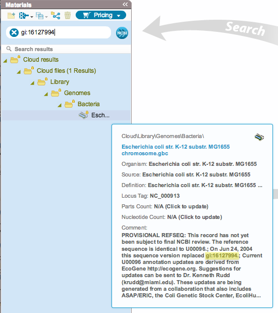

-   For example, you can find the genome of this strand of E.coli by
    looking for the GI number that appears in the comment section
    (Figure [1.6.2.1](#x1-36001r1)).

    ------------------------------------------------------------------------

    

    
    
    

    Figure 1.6.2.1: Example: search for the GI number.

    

    

    ------------------------------------------------------------------------
