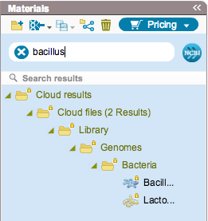
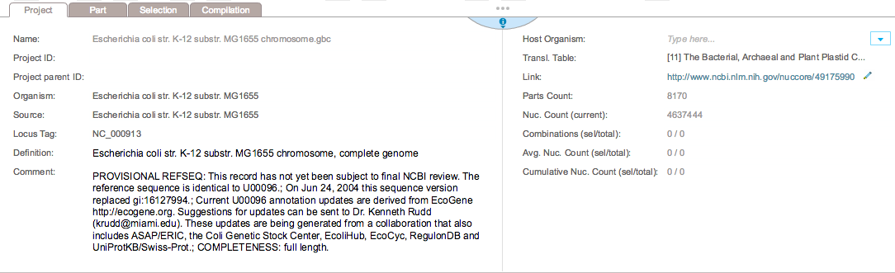
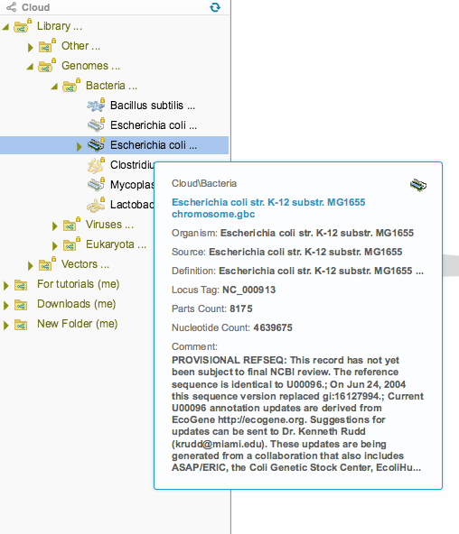

Type a keyword in the search bar. Results will appear below
(Figure [1.6.1.1](#x1-35001r1)).

------------------------------------------------------------------------

Figure 1.6.1.1: Search for
a keyword in the Materials box.

-   

    ------------------------------------------------------------------------

-   The search tool will look for your keyword in everything contained
    in the project meta data, including its name, comments, etc. Meta
    data for each project can be found in the project tab
    (Figure [1.6.1.2](#x1-35002r2)) located along the bottom of each
    opened project or in a tooltip while hovering over the closed
    project in the Materials box (Figure [1.6.1.3](#x1-35003r3)).

    ------------------------------------------------------------------------

    

    
    
    

    Figure 1.6.1.2: The
    project tab showing the project meta data.

    

    

    ------------------------------------------------------------------------

    ------------------------------------------------------------------------

    

    
    
    

    Figure 1.6.1.3: Tooltip showing the project meta data.

    

    

    ------------------------------------------------------------------------
