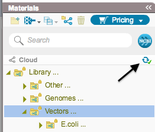

-   Folders saved in the cloud appear in the Materials box and are
    marked with a cloud icon. Refresh the cloud by clicking the “Refresh
    Cloud” icon (Figure [1.9.1.1](#x1-43001r1)).

    ------------------------------------------------------------------------

    

    
    
    

    Figure 1.9.1.1: The
    ”Refresh Cloud” icon in the Materials box.

    

    

    ------------------------------------------------------------------------
