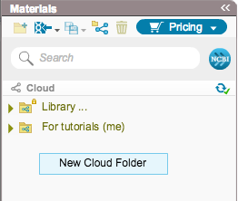

-   To create a new folder, right click and select “New Cloud Folder”
    (Figure [1.9.2.1](#x1-44001r1)). You can also create new folders via
    the ”Cloud Folder Settings” dialog as explained in
    section [1.9.5](#x1-470001.9.5).

    ------------------------------------------------------------------------

    

    
    
    

    Figure 1.9.2.1: ”New
    Cloud Folder” in the right click menu.

    

    

    ------------------------------------------------------------------------
