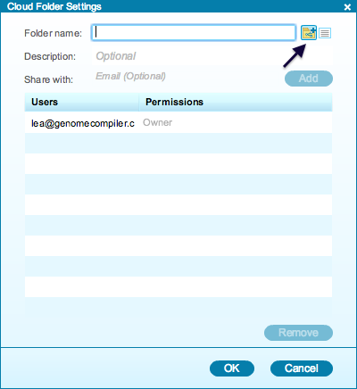

-   You can also create new folders from the “Cloud Folder Settings”
    dialog (Figure [1.9.5.1](#x1-47001r1)) by clicking on the “New
    Folder” icon. Enter the new folder’s name and an optional folder
    description.

    ------------------------------------------------------------------------

    

    
    
    

    Figure 1.9.5.1: The
    ”New Folder” icon in the ”Cloud Folder Settings” dialog.

    

    

    ------------------------------------------------------------------------
