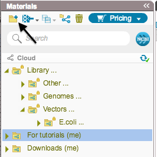
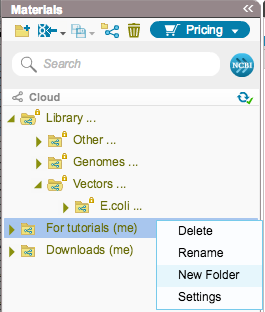

-   You can also create subfolders. Click the “New Folder” icon in the
    Materials box, or right click and select “New Folder”
    (Figure [1.9.3.2](#x1-45003r2)).

    ------------------------------------------------------------------------

    

    
      The ”New Folder” icon in
    the Materials box.  

      ”New Folder” in the
    right click drop down menu.\

    

    Figure 1.9.3.2: Create
    Cloud subfolders in the Materials box.

    

    

    ------------------------------------------------------------------------
