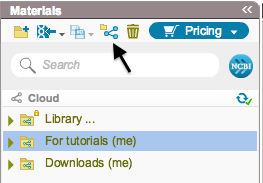
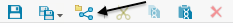
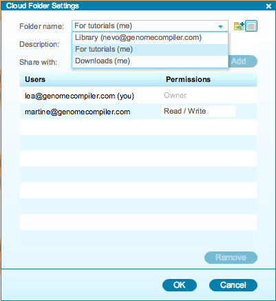
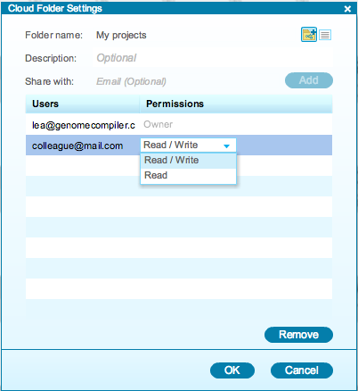

-   Folders can be shared via the “Cloud Folder Settings” dialog. It can
    be accessed by clicking the “Cloud Settings” icon in the Materials
    box or in the toolbar (Figure [1.9.4.2](#x1-46003r2)). In this
    dialog select the folder from the drop down menu which you would
    like to share.

    ------------------------------------------------------------------------

    

    
      The ”Cloud Settings”
    icon in the Materials box.  

      The ”Cloud Settings”
    icon in the toolbar.\

    

    Figure 1.9.4.2: The
    ”Cloud Settings” icon.

    

    

    ------------------------------------------------------------------------

-   You can also share a folder directly by right clicking on a folder
    and selecting “Settings” (Figure [1.9.4.3](#x1-46004r3)). Please
    note that you cannot share subfolders.

    ------------------------------------------------------------------------

    

    
    
    

    Figure 1.9.4.3: ”Settings” in the right click drop down menu.

    

    

    ------------------------------------------------------------------------

-   You can share folders with other users. Select which folder you
    would like to share from the drop down menu
    (Figure [1.9.4.4](#x1-46005r4)). Enter their email address in the
    ”Share with” field and click “Add”. They will receive an email
    telling them that you would like to share a folder.

    ------------------------------------------------------------------------

    

    
    
    

    Figure 1.9.4.4: The
    ”Cloud Folder Settings” dialog: choosing a folder.

    

    

    ------------------------------------------------------------------------

-   To manage permissions, select “Read/Write” or “Read” from the drop
    down menu (Figure [1.9.4.5](#x1-46006r5)). To remove users from the
    list, click “Remove”.

    ------------------------------------------------------------------------

    

    
    
    

    Figure 1.9.4.5: The
    ”Cloud Folder Settings” dialog: managing permissions.

    

    

    ------------------------------------------------------------------------
