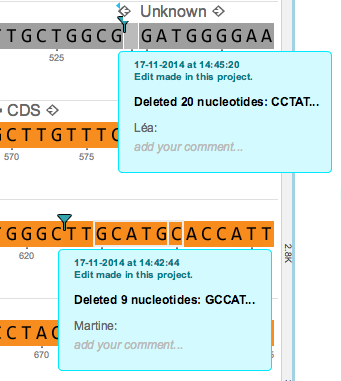

-   Multiple users can make changes on the same sequence
    (Figure [1.11.3.1](#x1-57001r1)).

    ------------------------------------------------------------------------

    

    
    
    

    Figure 1.11.3.1: Changes from multiple users on a single
    sequence.

    

    

    ------------------------------------------------------------------------
