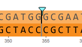

-   DNA and amino acid changes are tracked and indicated in the form of
    a blue flag on the sequence (Figure [1.11.1.1](#x1-55001r1)).

    ------------------------------------------------------------------------

    

    
    
    

    Figure 1.11.1.1: Blue
    flags indicate changes.

    

    

    ------------------------------------------------------------------------
