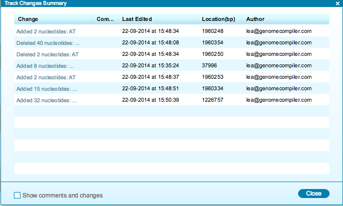

-   To view a summary table of all changes, click the track changes
    “Summary table” icon in the toolbar drop down Layers menu
    (Figure [1.11.4.1](#x1-58001r1)). You can remove the changes from
    the views by unchecking the box.

    ------------------------------------------------------------------------

    

    
    
    

    Figure 1.11.4.1: The
    track changes ”Summary table” icon in the toolbar drop down Layers
    menu.

    

    

    ------------------------------------------------------------------------

-   The “Track Changes Summary” table (Figure [1.11.4.2](#x1-58002r2))
    displays all the changes in the project, as well as their location,
    author, the time and date that they were made and prospective
    comments. You can navigate to each change in the DNA sequence by
    clicking on it. Click the “Show comments and changes” box to include
    in this list any user comments which were also made in this project.

    ------------------------------------------------------------------------

    

    
    
    

    Figure 1.11.4.2: The
    “Track Changes Summary” table.

    

    

    ------------------------------------------------------------------------
