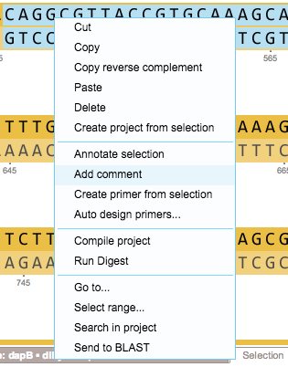

-   To comment a whole part/gene, right click and select “Add comment”
    from the drop down menu (Figure [1.10.3.1](#x1-51001r1)).

    ------------------------------------------------------------------------

    

    
    
    

    Figure 1.10.3.1: ”Add
    comment” in the right click drop down menu.

    

    

    ------------------------------------------------------------------------

-   Add your comment in the comment tool tip
    (Figure [1.10.3.2](#x1-51002r2)). You can include direct links. To
    navigate to links, click on them while holding the control key. You
    can delete comments by clicking the “Delete” icon.

    ------------------------------------------------------------------------

    

    
    
    

    Figure 1.10.3.2: The
    comment tool tip: including a direct link.

    

    

    ------------------------------------------------------------------------

-   To comment a stretch of nucleotides, right click on them and select
    “Add comment” from the drop down menu
    (Figure [1.10.3.3](#x1-51003r3)).

    ------------------------------------------------------------------------

    

    
    
    

    Figure 1.10.3.3: ”Add
    comment” in the right click drop down menu.

    

    

    ------------------------------------------------------------------------

-   Add your comment in the tool tip (Figure [1.10.3.4](#x1-51004r4)).

    ------------------------------------------------------------------------

    

    
    
    

    Figure 1.10.3.4: The
    comment tool tip.

    

    

    ------------------------------------------------------------------------
