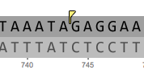

-   You can make comments on all abstraction layers. Comments are
    indicated by yellow flags (Figure [1.10.1.1](#x1-49001r1)).

    ------------------------------------------------------------------------

    

    
    
    

    Figure 1.10.1.1: Yellow flags indicate comments.

    

    

    ------------------------------------------------------------------------
