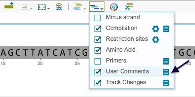
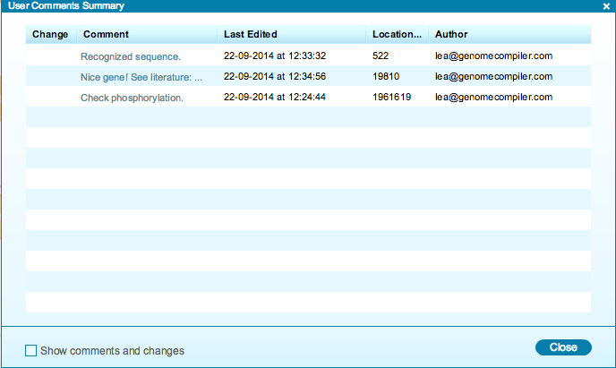

-   To view a summary table of all comments, click the “Summary table”
    icon in the toolbar drop down Layers menu
    (Figure [1.10.5.1](#x1-53001r1)). You can remove the comments from
    the views by unchecking the box. However, you will still be able to
    add comments.

    ------------------------------------------------------------------------

    

    
    
    

    Figure 1.10.5.1: The
    comments ”Summary table” icon in the toolbar drop down Layers
    menu.

    

    

    ------------------------------------------------------------------------

-   The “User Comments Summary” table (Figure [1.10.5.2](#x1-53002r2))
    displays all the comments, as well as their location, author and the
    time and date that they were made. You can navigate to each comment
    in the sequence by clicking on it. Click the “Show comments and
    changes” box to include in this list the track changes that were
    also made in this project.

    ------------------------------------------------------------------------

    

    
    
    

    Figure 1.10.5.2: The
    ”User Comments Summary” table.

    

    

    ------------------------------------------------------------------------
