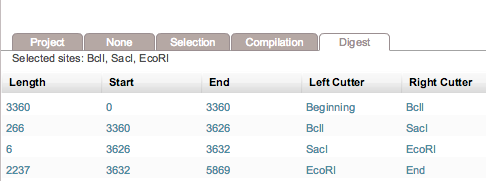

-   Click “Run Digest” and all the information regarding digested
    fragment sizes will be displayed in the “Digest” summary table at
    the bottom of your screen (Figure [1.17.3.1](#x1-81001r1)). The
    selected cut sites now appear on the different abstraction layer
    views (Figure [1.17.3.3](#x1-81005r3)). You can navigate to the DNA
    view of the different sites by clicking in the corresponding line of
    the “Digest” summary table.

    ------------------------------------------------------------------------

    

    
    
    

    Figure 1.17.3.1: The
    “Digest” summary table.

    

    

    ------------------------------------------------------------------------

    ------------------------------------------------------------------------

    

    
      Circular view.  

      Linear view.  

      DNA view.\

    

    Figure 1.17.3.3: Cut
    sites in the different views.

    

    

    ------------------------------------------------------------------------
