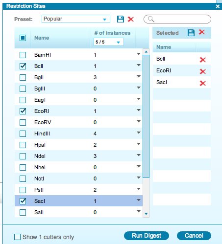

-   The “Restriction Sites” window will appear
    (Figure [1.17.2.1](#x1-80001r1)). Select the desired restriction
    enzymes for your digest. This window works in a similar fashion to
    the “Restriction Sites” dialog (see section [1.16](#x1-750001.16)).

    ------------------------------------------------------------------------

    

    
    
    

    Figure 1.17.2.1: The
    “Restriction Sites” window.

    

    

    ------------------------------------------------------------------------
